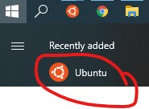

### Docker for Windows, with WSL2

This is the recommended approach to set up your development environment if you use Windows.

NOTE: If this seems like a lot,
and you already have a non-Docker development environment that you share with other projects,
it might be easier to use the [Do It Yourself](diy.md) approach, instead.

### Instructions

1. Ensure you have [Docker Desktop](https://www.docker.com/products/docker-desktop) 3.1.0 or higher installed.
   
   Allow the installer to take you through the process of using WSL2.
   
   Afterward, the checkbox under `Settings > General > Use the WSL2 based engine` should be checked.

1. Install [Ubuntu 20.04 LTS](https://www.microsoft.com/store/productId/9NBLGGH4MSV6) for WSL from the Microsoft Store.

   When you need to run some commands inside the Ubuntu VM,
   open the newly installed Ubuntu program.
   
   

   This will open a terminal inside the VM.
   
1. Enable Docker integration with the newly installed Ubuntu distribution.

   Under Docker Desktop `Settings > Resources > WSL INTEGRATION > Enable integration with additional distros: > Ubuntu`
   ensure the toggle is switched on.

   Inside the Ubuntu VM, you should now be able to run the command `docker --version`.

1. Inside a new, blank folder, in the Ubuntu VM,
   get the code for this exercise by using the Composer `create-project` command.

   ```
   sudo docker run --rm --volume $PWD:/app --user "$(id -u):$(id -g)" composer create-project --prefer-dist playground-sessions/php-code-exercise .
   ```

   (The `--user` flag ensures that the files you get remain owned by you.)

1. Run docker compose, inside the Ubuntu VM, to create and run all the docker containers in this environment.

   Before running this command, make sure that any services (eg. Apache, Nginx, etc.) which normally listen
   on ports 80, 3306, 6379, or 9000 are not running.
   ```
   sudo docker-compose up -d --build
   ```
   
   (The `--build-arg` flags ensure that lumen logs can be written.)

1. You should now see the text `Lumen (8.2.1) (Laravel Components ^8.0)` at [http://localhost](http://localhost)

1. Initialize a git repository, and create an initial commit.

1. It should take about 2 seconds to load [http://localhost/student-progress/1](http://localhost/student-progress/1)

1. Read the rest of the [README.md](../README.md).  Your development environment is all set up!

#### FAQs

1. How do I edit these files from Windows?
   
   You can see these files from the Windows File Explorer at `\\wsl$\Ubuntu\home\<your-user>\`, where `<your-user>`
   is the username that you used when you set up Ubuntu.
   
   You can open any folder/file from this path, using your favorite code editor.

1. How do I reset this docker setup, without losing any of my code?
   
   Run the following commands inside the Ubuntu VM.
   This will stop and remove all the containers in this project, and rebuild the containers.
   ```
   sudo docker-compose down
   sudo docker-compose up -d --build
   ```

1. How do I run vendor binaries, like phpunit?
   
   You can run vendor binaries like phpunit within the `app-php` container.
   
   These commands may be run from Windows PowerShell or from the Ubuntu VM.
   ```
   docker exec -it app-php /application/vendor/bin/phpunit
   ```
   To execute another binary, replace "phpunit" with the name of the binary.

   Should you want to run artisan commands, you can do so in the same way.
   ```
   docker exec -it app-php php artisan ...
   ```
